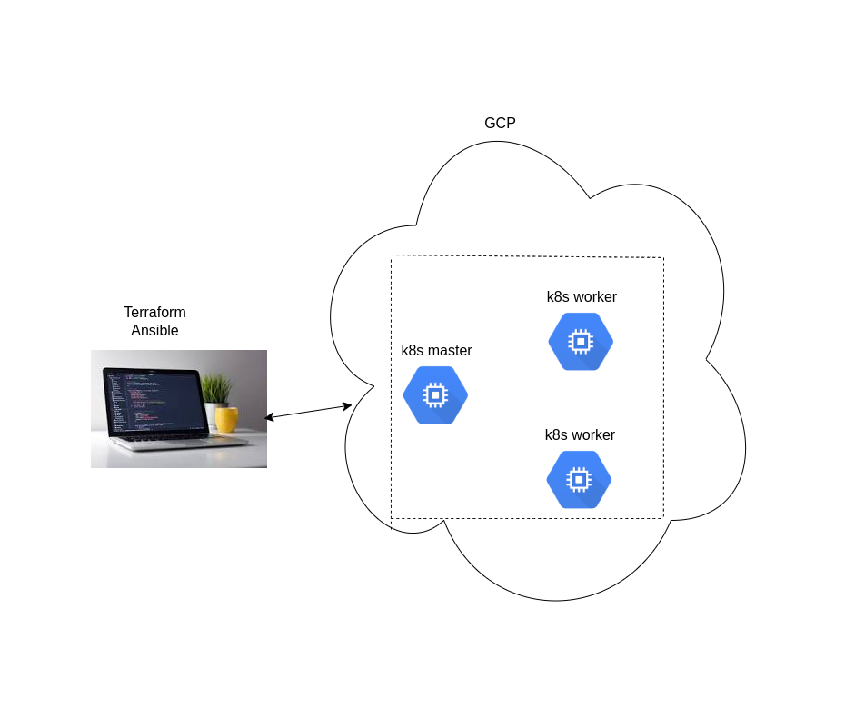
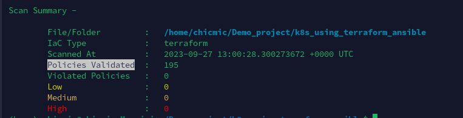
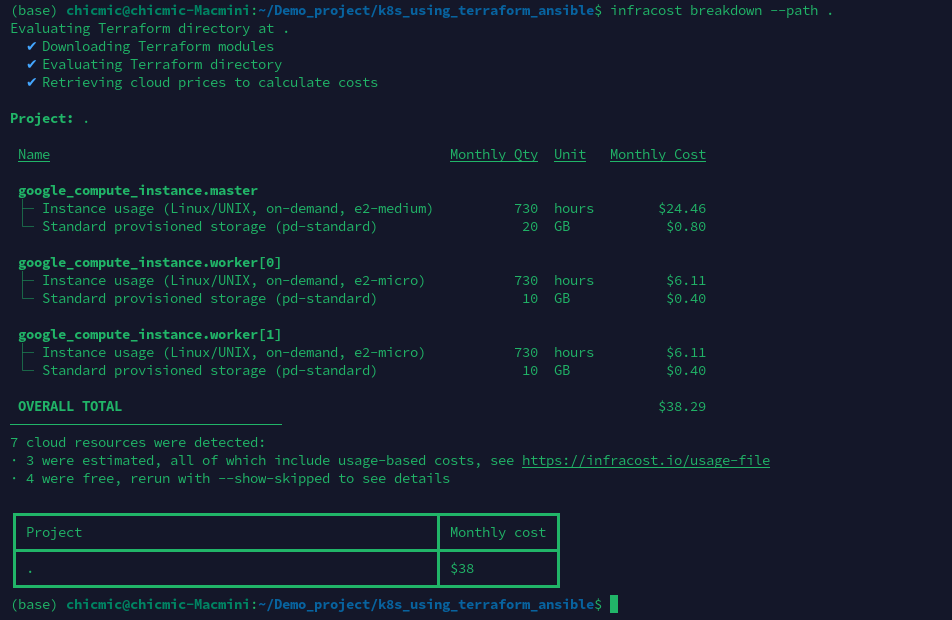

# Automating Kubernetes Cluster Deployment with Terraform and Ansible on Google Cloud Platform (GCP)

This project automates the provisioning of a Kubernetes cluster using Terraform and configures it with Ansible. It sets up one Kubernetes master node and two worker nodes on Google Cloud Platform (GCP). The infrastructure setup and configuration are fully automated, making it easy to deploy and manage a Kubernetes cluster.
## Overview


## Table of Contents

- [Prerequisites](#prerequisites)
- [Getting Started](#getting-started)
- [Policy Validation Summary](#scan-policy-validation-using-terrascan)
- [Cost Summary](#mothly-cost-calculated-using-infracost)

## Prerequisites

Before you begin, ensure you have the following prerequisites:

- [Terraform](https://www.terraform.io/downloads.html) installed.
- [Ansible](https://docs.ansible.com/ansible/latest/installation_guide/intro_installation.html) installed.
- **Google Cloud Platform Account:** You need a GCP account with appropriate permissions to create and manage resources. Also, ensure that you have a JSON service account key file (`terraform-gcp-provider-64fb3b5e93e3.json`) for authentication.
- **SSH Key Pair:** This configuration assumes you have an SSH key pair configured on your local machine. If not, you can generate one using `ssh-keygen`. Replace `"~/.ssh/id_rsa.pub"` in the configuration with the path to your public SSH key.
## Getting Started

1. Clone this repository to your local machine:

   ```bash
   git clone https://github.com/singhragvendra503/k8s_using_terraform_ansible.git
   cd k8s_using_terraform_ansible
2. Put JSON service account key file (`terraform-gcp-provider-64fb3b5e93e3.json`) for authentication.
3. ```bash
    terraform init

    terraform validate

    terrafrom plan

    terrafrom apply --auto-approve
4. Give execution permission to the `dynamic_inventory.sh` file and run it. It will set hosts in the Ansible hosts file at `/etc/ansible/hosts`.
    ```bash
    ./dynamic_inventry.sh
5. Finally run 
    ```bash
    ansible-playbook main_playbook.yaml
6. For varification run some command in k8s master
    ```bash
    kubectl get nodes

    kubectl get pods -A

## Scan Policy Validation Using [terrascan](https://runterrascan.io/)

## Mothly Cost Calculated Using [infracost](https://www.infracost.io/)

